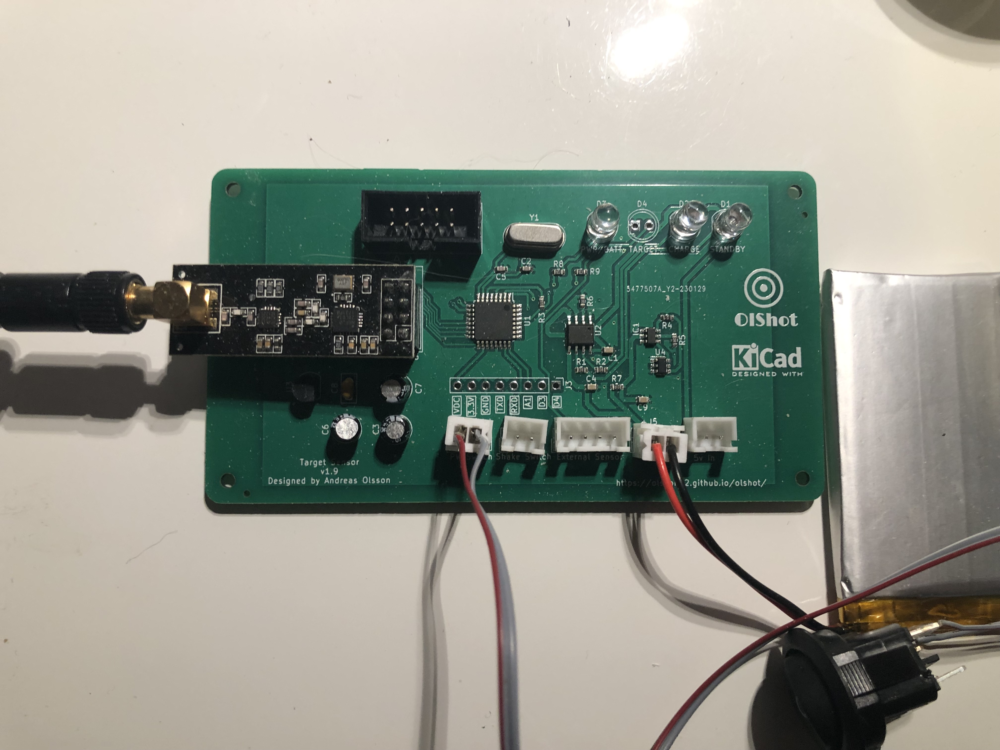

# OlShot
This is an Arduino based Shooting game system. Free to use, you need to make the components your self.

It's wireless and uses nrf24l01 modules to communicate to the targets and the main system.

## How mutch does it cost to buid ?
Well it will cost you some money, for the components, and maufactoring the pcb, **BUT** to have your custom build game is priceless.

## Many Targets
If you are going to use many targets, you need to redesign main unit pcb to work with **ATmega2560** chip (same as in Arduino Mega)
The code here is by default set for 5 targets, but you can adjust it. Test the code in Arduino software when you change to see if your amount of targets
is accepted.

# Read more
* [Wiki](https://github.com/olsson82/olshot/wiki)
* [Targets](page/targets.md)
* [Main Unit](page/mainunit.md)

## Still in development
The system is still in development and this page will be updated during the progress.

## Updates
**2023-08-04: Working on the code for main unit and design for the touchscreen.**

### Main Unit
**2023-08-01: Kicad files now uploaded**

**2023-07-31: The main unit has been tested and everything seems to be working. The kicad files will soon be uploaded.**

<figure>
    
    <figcaption>Front side of the PCB.</figcaption>
</figure>

### Target PCB
**2023-02-05: The Target PCB Is now avalible for kicad and arduino code.**

Did a redesign of the target sensor, everything is now on the top side. Added jst connections instead of soldering.
<figure>
    
    <figcaption>Front side of the PCB.</figcaption>
</figure>

## Discuss
Feel free to take part in this project. Go to [Discussion](https://github.com/olsson82/olshot/discussions) to ask questions or discuss about the project.
