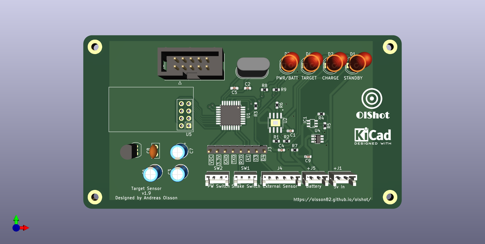
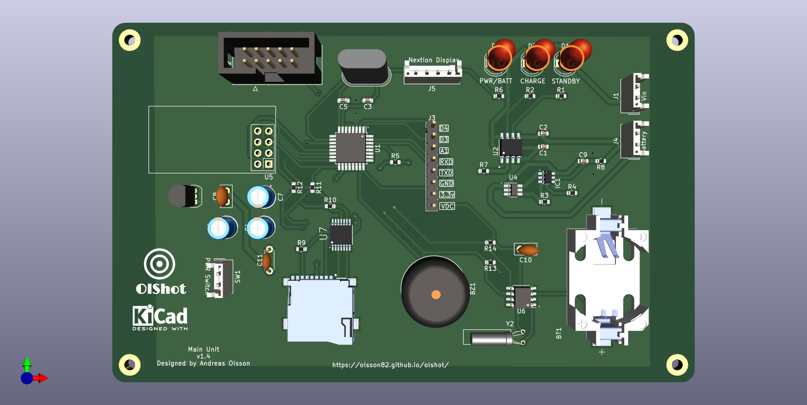

# OlShot
This is an Arduino based Shooting game system. Free to use, you need to make the components your self.

It's wireless and uses nrf24l01 modules to communicate to the targets and the main system.

# Read more
* [Targets](page/targets.md)
* [Main Unit](page/mainunit.md)

## Still in development
The system is still in development and this page will be updated during the progress.

## Updates
### Target PCB
Did a redesign of the target sensor, everything is now on the top side. Added jst connections instead of soldering.
<figure>
    
    <figcaption>Front side of the PCB.</figcaption>
</figure>

### Main Unit
The design for the main unit pcb is done (i think) Need to check everything one, two and three times :) So it's all correct.
Like the target pcb it has built in charger for lipo batterys, also it has sd card support for save info. And also a RTC (Real Time Clock)
<figure>
    
    <figcaption>Front side of the PCB.</figcaption>
</figure>

## Discuss
Feel free to take part in this project. Go to [Discussion](https://github.com/olsson82/olshot/discussions) to ask questions or discuss about the project.
