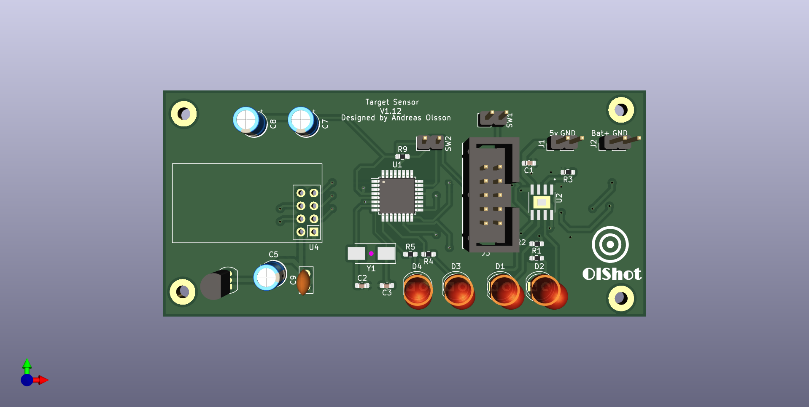

# OlShot
This is an Arduino based Shooting game system. Free to use, you need to make the components your self.

It's wireless and uses nrf24l01 modules to communicate to the targets and the main system.

# Read more
* [Targets](page/targets.md)
* [Main Unit](page/mainunit.md)

## Still in development
The system is still in development and this page will be updated during the progress.

## Updates
### Target PCB
The first layout of the PCB has been done. Already i know i need to do some adjustment. And add some stuff but right now it look like this:
<figure>
    
    <figcaption>Front side of the PCB.</figcaption>
</figure>

### Main Unit
The schematic for the main unit is done, and the PCB design has started. There may be changes during the progress.

## Discuss
Feel free to take part in this project. Go to [Discussion](https://github.com/olsson82/olshot/discussions) to ask questions or discuss about the project.
