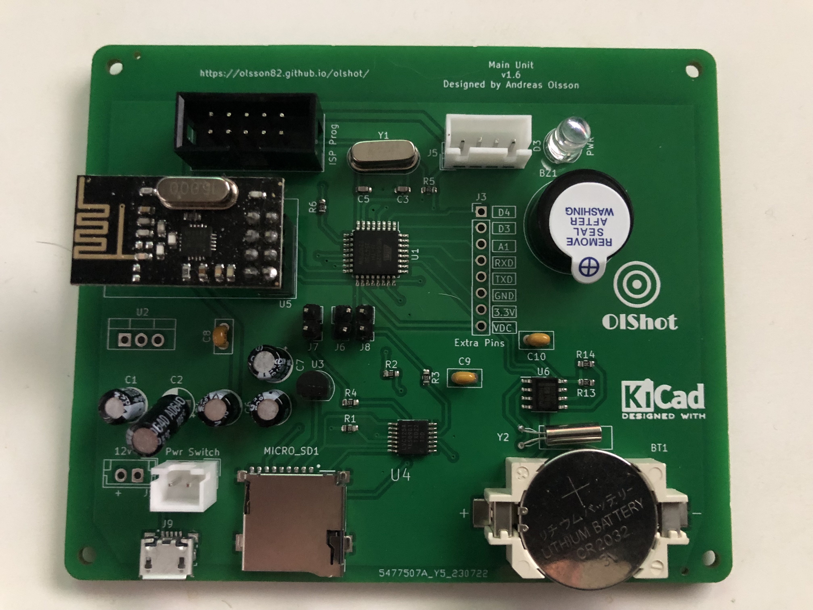

# Main Unit

The main unit is the big brain in all this. It is based on the ATmega328 chip that you will find in example arduino nano. The main unit has:

* SD Card Reader
* USB Powered (Runs from powerbank)
* Nextion display (For all controls)
* Buzzer
* Built in RTC for time.

## How it works
You control everything from the Nextion Display. You can setup all settings from the Settings Page, like targets, how many players and so on.
Select a game and start playing. The main unit will send out to the right target to get ready for the hit mode. When target is returning, a new target will be selected.

Targets are selected randomly, so you never know what target will light. Also in Quicktime mode the time is randomly selected so you don't know when the new target will light up.

## The Games
There are three games to play:

### Quicktime
You can have up to 10 rounds, and you need to shoot fast when the target lights up. The time between the rounds are randomly selected. Shoot fast!

### Rapidfire
You set the total shots needed, then you need to shoot fast! So if you set 20 shots, you need to shoot them realy fast!

### Timed mode
You set the time to play, then shot so many targets you can on that time.

## PCB
All files for manufacture is avalible and the main unit will look like this:

<figure>
    
    <figcaption>The Main Unit PCB.</figcaption>
</figure>
