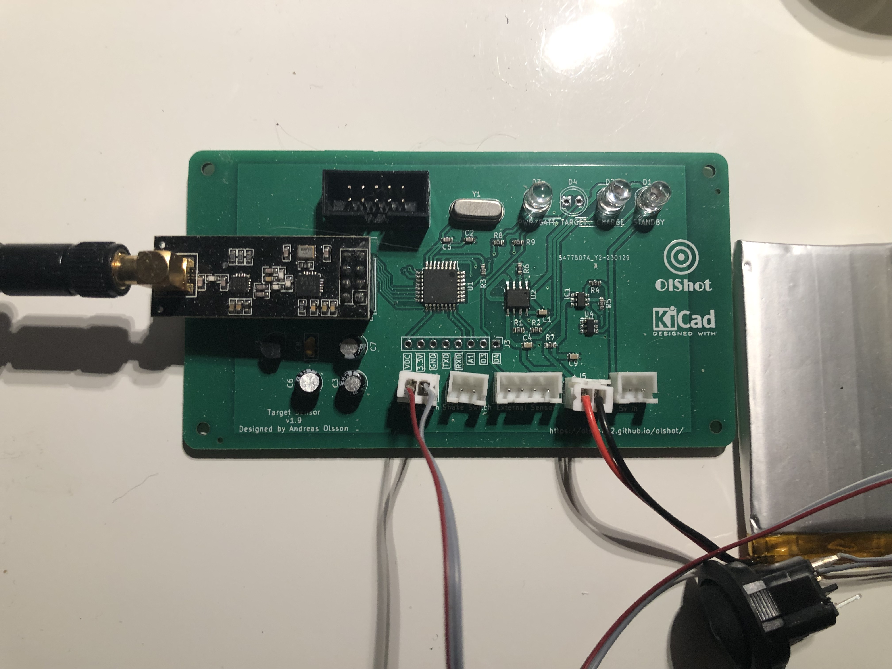

# Wireless Targets

The wireless targets are battery powered and runs on LiPo battery. They use ATMega328P-AU Chip that is in arduino nano. But you can use any Arduino.

## How it works
When the main unit trigger the target sensor, they will wait until vibration starts from an vibration sensor. Normaly you place it on behind the target. And they will send back that they have been trigged.

Each sensor has it unique code, one for recive data, and one for send data, so they know when they are going to be activated.

When the main unit trigger the sensor a **blue** light will be activated, to inform the shooter that it is time to shoot.

## PCB
All files for making the target sensor is avalible and it will look like this:

<figure>
    
    <figcaption>The Target Sensor PCB.</figcaption>
</figure>
